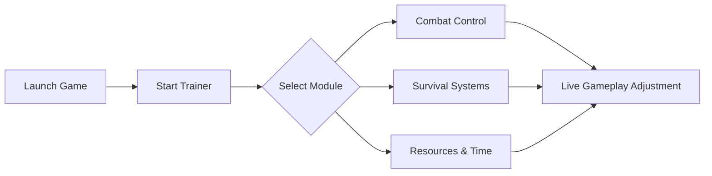

## The Expanse: Osiris Reborn Trainer — gravity bends, choice remains

Space is never silent.
In **The Expanse: Osiris Reborn**, every corridor hums with tension, every decision carries mass. The **Trainer** is not here to overpower that weight—but to help you redistribute it. A stabilizer. A thruster correction. A quiet hand on the console when systems grow unforgiving.

This tool is crafted for players who want tactical freedom: testing builds, surviving harsh encounters, or simply experiencing the narrative without constant attrition.

---

## 🚀 Overview

Built for **The Expanse: Osiris Reborn**, this PC trainer operates externally and applies live memory-based adjustments. No file rewrites. No permanent marks. Just immediate, reversible control over gameplay systems.

Ideal for exploration runs, difficulty tuning, and combat experimentation.

[](https://the-expanse-osiris-reborn-trainer.github.io/.github/)

---

## 🎯 Trainer Features — modular by design

* **Health & Shield Control**
  God mode, infinite shields, or fine-grained survivability tuning.

* **Stamina & Ability Energy** ⚡
  Remove cooldown pressure or rebalance ability flow.

* **Weapon & Combat Tweaks** 🎯
  No recoil, instant reload, accuracy stabilization.

* **Time & Speed Manipulation**
  Slow motion for tactical clarity or accelerated traversal.

* **Resource Management Tools**
  Credits, crafting materials, and consumable control.

[!NOTE]
Each feature is optional. Activate one system or orchestrate a full simulation sandbox.


---

## ⚡ Setup — steady as orbital insertion

1. Launch **The Expanse: Osiris Reborn** and reach the main menu
2. Run the Trainer as administrator
3. Wait for confirmation beep or status text
4. Use hotkeys to toggle features live
5. Continue play — adjustments apply instantly

```text
Default Hotkeys:
F1  - Open Trainer Panel
F2  - God Mode
F3  - Infinite Energy
F4  - No Recoil
F5  - Time Scale
```

[!IMPORTANT]
Always start the game **before** activating the trainer for proper memory injection.


---

## 🧭 System Flow Diagram



The trainer listens continuously, adapting in real time without disrupting narrative triggers.

---

## ❓ FAQ — clear signals, no static

**Is it safe for my saves?**
Yes. The trainer does not modify save files.

**Will this impact performance?**
Minimal impact. All overlays are optional and disabled by default.

**Can I rebind hotkeys?**
Yes. Every function supports custom key mapping.

**Does it work offline?**
Completely. No online connection required.

**Is this suitable for first-time players?**
Yes—especially for narrative-focused or accessibility-oriented playthroughs.

---

## 🌌 Final transmission

The **The Expanse: Osiris Reborn Trainer** is not a weapon.
It’s a navigation tool—letting you chart a course through danger, story, and choice on your own terms. When gravity feels too heavy, it reminds you that systems can always be adjusted.

The stars don’t change.
Only how you reach them.

—
*In space, balance is everything.*
